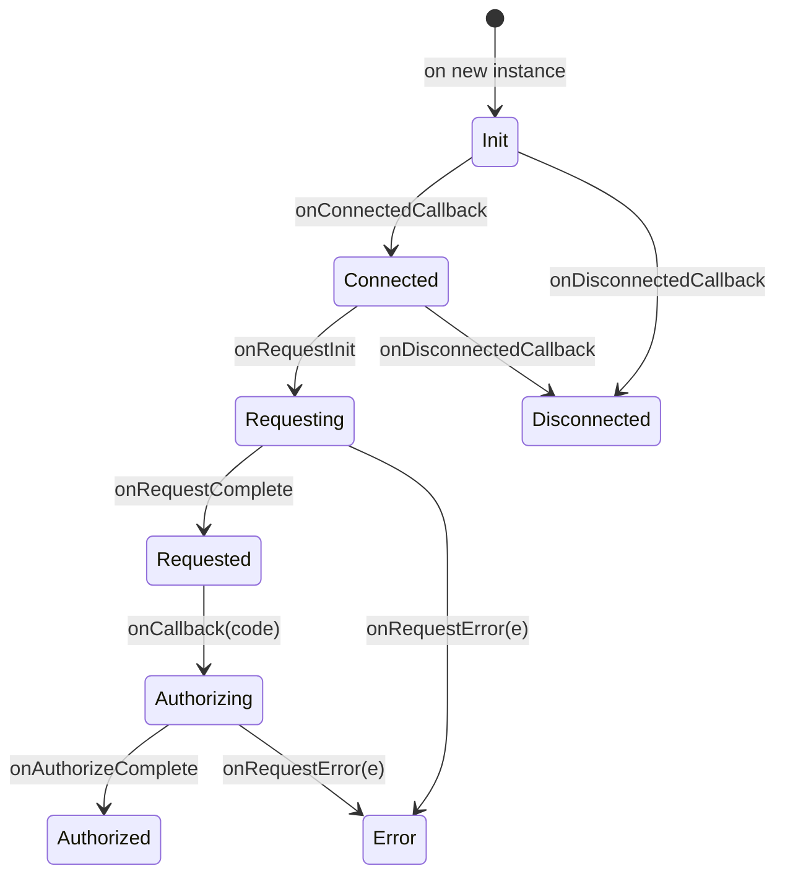

# nopwd-sdk

Go passwordless using magic link and passkeys authentication

## Components

`<np-email-signin><np-email-signin/>` state diagram.

```mermaid
stateDiagram
    [*] --> Init: on new instance
    Init --> Connected: onConnectedCallback
    Init --> Disconnected: onDisconnectedCallback
    Connected --> Requesting: onRequestInit
    Connected --> Disconnected: onDisconnectedCallback
    Requesting --> Requested: onRequestComplete
    Requesting --> Error: onRequestError(e)
    Requested --> Authorizing: onCallback(code)
    Authorizing --> Authorized: onAuthorizeComplete
    Authorizing --> Error: onRequestError(e)


```

## Library

## Rest API
